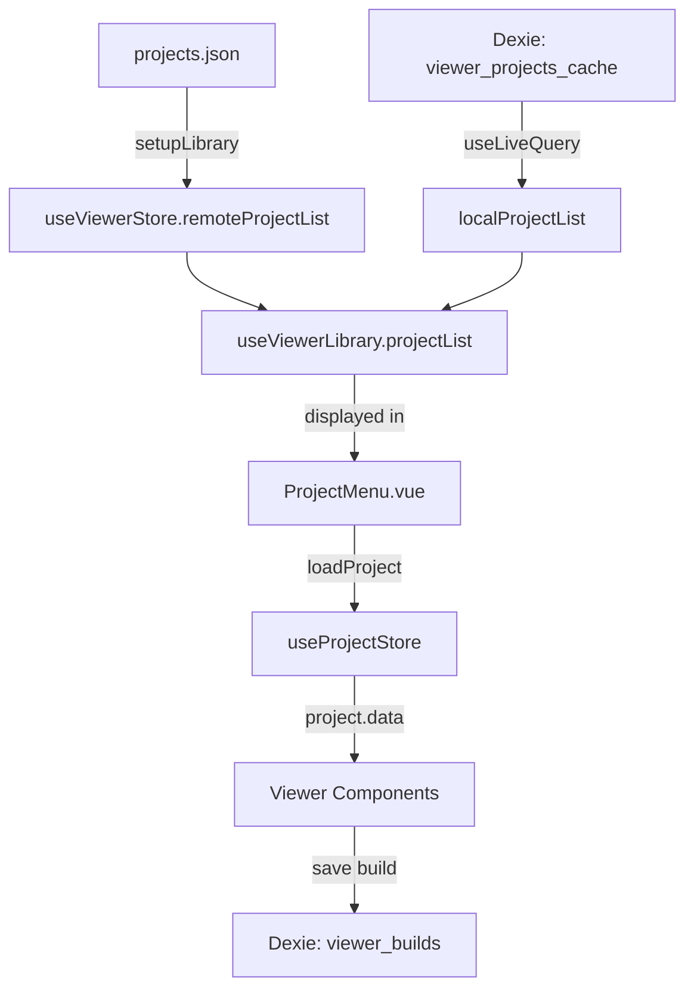

# Architecture Overview

This document describes the architecture and codebase structure of ICC Neo (Interactive CYOA Creator Neo).

## Application Modes

ICC Neo has two distinct modes:

1. **Viewer** (working): Browse and interact with CYOA projects
   - Reads **V1 format** for MeanDelay iCYOA compatibility
   - Primary focus of active development

2. **Editor** (prototype): Create and edit CYOA projects
   - Uses **V2 format** internally (not yet finalized)
   - Converts V1 to V2 on import

## Tech Stack

| Layer           | Technology                            |
| --------------- | ------------------------------------- |
| Framework       | Nuxt 4 (SPA mode, `ssr: false`)       |
| Language        | TypeScript (strict mode)              |
| UI Library      | PrimeVue 4 with "Gold Morning" preset |
| CSS             | TailwindCSS v4                        |
| State           | Pinia with persistence                |
| Database        | Dexie (IndexedDB wrapper)             |
| Icons           | Iconify (carbon, solar collections)   |
| Package Manager | Yarn 4 (Berry)                        |

## Directory Structure

```bash
cyoa-editor/
├── app/                          # Application source code
│   ├── components/               # Vue components
│   │   ├── viewer/               # Viewer mode components
│   │   ├── editor/               # Editor mode components
│   │   └── utils/                # Shared utility components
│   ├── composables/              # Business logic and state
│   │   ├── project/              # Project data model and types
│   │   │   ├── types/v1/         # V1 format types (viewer)
│   │   │   ├── types/v2/         # V2 format types (editor)
│   │   │   ├── schema/           # Yup validation schemas
│   │   │   └── import.ts         # Format detection and conversion
│   │   ├── store/                # Pinia stores
│   │   ├── viewer/               # Viewer-specific logic
│   │   ├── editor/               # Editor-specific logic
│   │   └── shared/               # Database tables, utilities
│   ├── pages/                    # Route pages
│   │   ├── index.vue             # Viewer (home page)
│   │   ├── editor.vue            # Editor page
│   │   └── debug.vue             # Debug utilities
│   └── assets/                   # CSS and static assets
├── public/                       # Static files
│   ├── config/viewer/            # Viewer configuration
│   │   ├── projects.json         # Project list
│   │   └── backgrounds.json      # Loading backgrounds
│   └── bgs/                      # Background images
├── prime/                        # PrimeVue theme customization
└── docs/                         # Documentation
```

## State Management

### Pinia Stores

| Store             | File                       | Purpose                     |
| ----------------- | -------------------------- | --------------------------- |
| `useProjectStore` | `store/project.ts`         | Project data, loading state |
| `useViewerStore`  | `store/viewer.ts`          | Viewer UI state, modals     |
| `useSettingStore` | `store/settings.ts`        | User preferences            |
| `useEditorStore`  | `editor/useEditorStore.ts` | Editor mode state           |

### Data Flow



## Data Persistence

Uses Dexie.js for IndexedDB storage:

| Table                      | Purpose                                  |
| -------------------------- | ---------------------------------------- |
| `viewer_builds`            | User-saved builds/choices in viewer mode |
| `viewer_projects_cache`    | Cached remote projects for offline use   |
| `editor_projects`          | Editor projects                          |
| `editor_projects_versions` | Editor project version history           |

## Styling System

- **TailwindCSS v4**: Custom configuration in `tailwind.config.mjs`
- **60-column grid**: Extended grid system for flexible layouts
- **PrimeVue themes**: Dark/light via `.dark-theme`/`.light-theme` classes
- **Dynamic styles**: Generated from project style rules at runtime

## URL/Path Resolution

Project `file_url` values are resolved using `document.baseURI` (set by Nuxt from `app.baseURL`):

- **Absolute URLs** (starting with `http`): Used directly
- **Relative paths**: Resolved via standard URL resolution (RFC 3986)

See [viewer-guide.md](viewer-guide.md) for details.

## Key Composables

| Composable         | Purpose                                   |
| ------------------ | ----------------------------------------- |
| `useViewerLibrary` | Project list management, caching, loading |
| `useBackpack`      | Backpack system for tracked items         |
| `usePoints`        | Point/score tracking                      |
| `useSearch`        | Full-text search across choices           |
| `useBuildNotes`    | User notes on builds                      |
